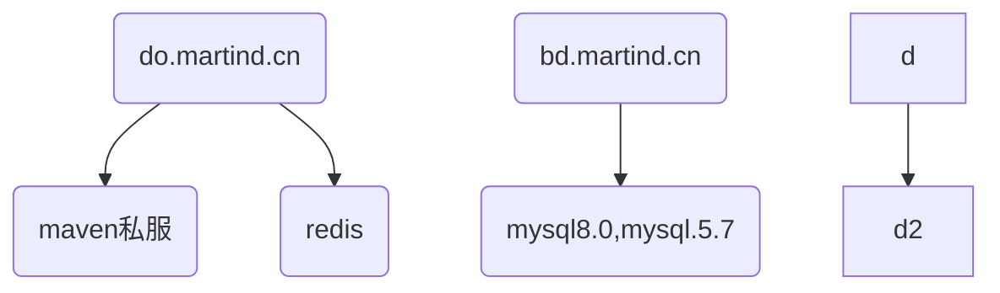
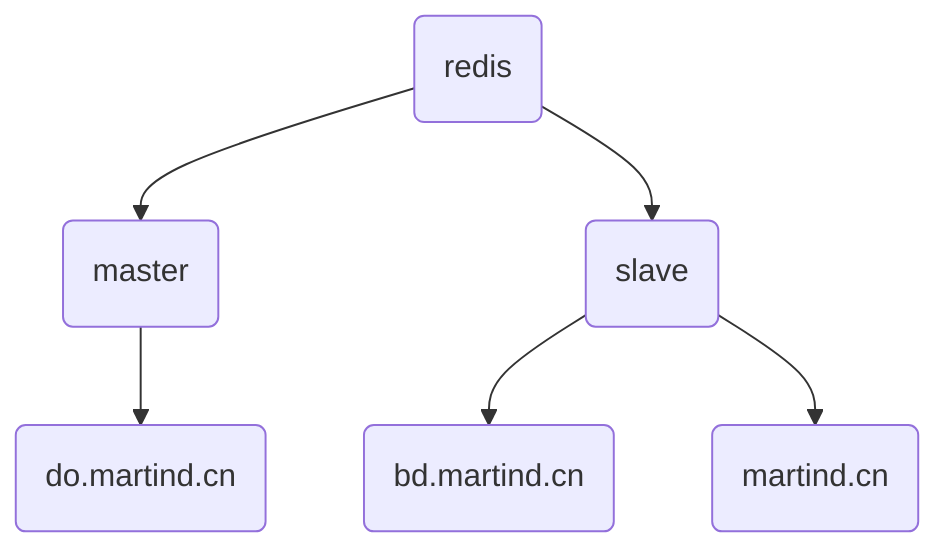
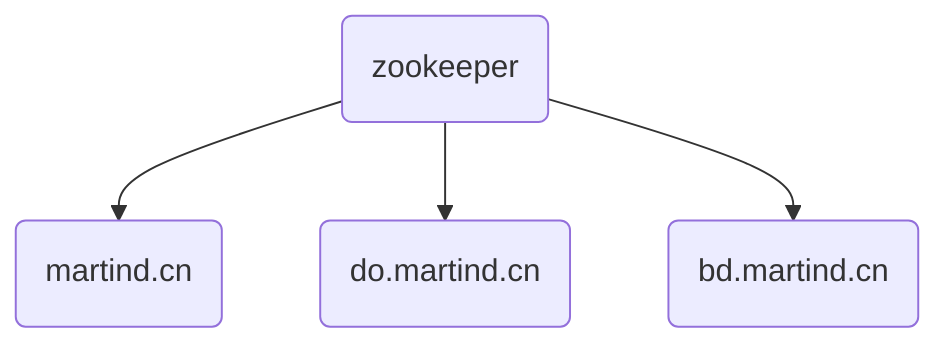

# 服务器

```mermaid
graph TD
do(do.martind.cn) --> do1(maven私服)
do --> do2(redis)

bd(bd.martind.cn) --> bd1(mysql8.0,mysql.5.7)
d --> d2
```
redis集群

```mermaid
graph TD

top(redis) --> t1(master)
t1 --> s1(do.martind.cn)
top --> t2(slave)
t2 --> s2(bd.martind.cn)
t2 --> s3(martind.cn)

```
zookeeper 集群

```mermaid
graph TD
top(zookeeper) --> m(martind.cn)
top --> m1(do.martind.cn)
top --> m2(bd.martind.cn)
```