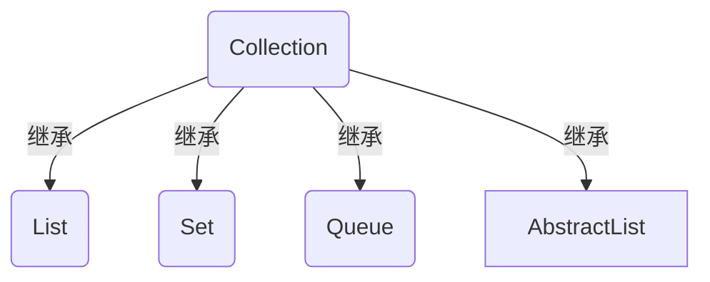
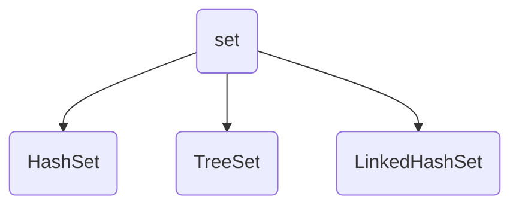

# java容器

## collection 接口
> collection是一个根接口


::: tip 抽象方法
* `abstract` 抽象方法，不能直接调用抽象方法，不能实例化。
* 不能被`private`修饰，因为抽象方法必须被子类实现，而private对于子类来说没有办法访问，所以会产生矛盾
* 不能被`static`修饰，如果用static修饰了，那么我们可以直接通过类名调用，而抽象方法压根就没有主体，没有任何业务逻辑，这样就毫无意义了。
* 抽象类不能使用final关键字修饰，因为final修饰的类是无法被继承，而对于抽象类来说就是需要通过继承去实现抽象方法，这又会产生矛盾。
* 抽象类与接口（interface）有很大的不同之处，接口中不能有实例方法去实现业务逻辑，而抽象类中可以有实例方法，并实现业务逻辑，比如我们可以在抽象类中创建和销毁一个线程池。
* 如果一个类继承了一个抽象类，那么它必须全部覆写抽象类中的抽象方法。
:::

### collection接口定义方法
`add()`:确保容器保持具有泛型类型T的参数，如果没有将此参数添加进容器，则返回false
`addAll(Collection<?> c)`：添加参数中所有元素
`clear()`：移除容器中所有元素

`contains(Object o)`：如果元素中包含o，则返回true

`containsAll(Collection<?> c)`：如果此Collection中包含c中所有元素，返回true

`equals(Object o)`：比较此Collection与指定对象是否相等

`hashCode()`：返回此collection的哈希码值

`isEmpty()`：如果此collection不包含元素，返回true

`iterator()`：返回此collection的元素上进行迭代的迭代器

`remove(Object o)`：从此collection中移除此元素的一个实例

`removeAll(Collection<?> c)`：移除参数中的元素

`retainAll(Collection<?> c)`：只保留参数中的元素，求交集

`size()`：返回容器中元素的数目

`toArray()`：返回包含此collection中的所有元素的数组

`toArray(T[] a)`：返回包含此collection中的所有元素的数组；返回数组的运行时类型与参数数组a的类型相同，不是单纯的Object

实例：

```java
public class LearnArray {
    public static void main(String[] args) {
        Collection<String> list = new ArrayList<>();
        list.add("hello");
        list.add("world");
        System.out.println("add()操作：");
        print(list);
        Collection<String> param = new ArrayList<>();
        param.add("a");
        param.add("b");
        System.out.println("addAll()操作：");
        list.addAll(param);
        print(list);
        System.out.println("移除前：");
        print(param);
        param.clear();
        System.out.println("移除后：");
        print(param);
        System.out.println(list.contains("a"));
    }
    private static void print(Collection<String> list){
        for (String str: list) {
            System.out.print(str+" ");
        }
        System.out.println();
    }
}
```

集合转数组：

```java
Collection<String> list = new ArrayList<>();
list.add("hello");
list.add("world");
Object[] array = list.toArray();
String[] str = list.toArray(new String[0]);
```

### List接口

> 继承Collection接口，包含Collection操作外，还提供如下操作：


`get(int index)`：获取指定位置元素

`indexOf(Object c)`：返回此列表中第一次出现的指定元素的索引；如果此列表不包含该元素，则返回-1

`lastIndexOf(Object o)`：返回此列表中最后出现的指定元素的索引；如果列表不包含此元素，则返回 -1

`listIterator()`：返回此列表元素的列表迭代器（按适当顺序）

`listIterator(int index)`：返回列表中元素的列表迭代器（按适当顺序），从列表的指定位置开始

`remove(int index)`：移除指定元素

`remove(Object o)`：移除第一次出现的指定元素

`removeAll(Collection<?> c)`：移除所有包含在c中的元素

`retainAll(Collection<?> c)`：仅保留c中包含的元素

`set(int index, E element)`：用指定元素替换列表中指定位置的元素

`subList(int fromIndex, int toIndex)`：返回列表中指定的 `fromIndex`（包括 ）和 `toIndex`（不包括）之间的部分视图


### Set接口

> set是不包含重复元素的collection，提供操作和collection完全相同，set是无序的




#### HashSet

> 为快速查找设计的Set，存入HashCode的元素必须定义hashCode()

### Queue接口

> 除了包含基本的Collection操作外，还提供一下操作：

`add(E e)`：将指定元素插入队列

`element()`：获取，但不移除此队列的头

`offer(E e)`：将指定元素插入队列，当使用有容量限制的队列时，此方法要优于`add()`，后者可能无法插入元素，而只是抛出一个异常

`peek()`，获取但不移除此队列的头；如果此队列为空，则返回null

`poll()`，获取并移除此队列的头；如果此队列为空，则返回null

`remove()`，获取并移除此队列的头

### AbstractCollection接口

> 提供Collection接口的骨干实现，最大限度地减少实现此接口的工作量