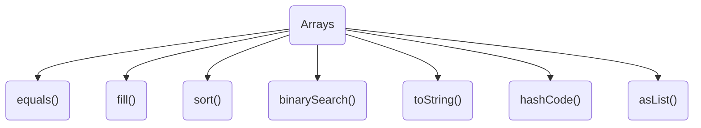

# java数组及操作数组常用方法

## 数组定义

```java
// 有初始值
String[] array = {"hello","world"};
String[][] array = {{"hello","world"},{"my","java"}};
// 无初始值
String[] array = new String[10];
String[][] array = new String[10][10];

```

## Arrays常见方法



> Type 包括 `boolean`,`byte`,`char`,`double`,`float`,`int`,`long`,`short`,`object`

### `fill()`

> `fill()`方法主要包括2个方法：
>
>  `fill(Type[],Type val)`
>
> ``fill(Type[] a,int fromIndex,int toIndex,Type val)`

示例：

```java
public static void main(String[] args) {
    int[] array = new int[10];
    int[] array1 = new int[10];
    Arrays.fill(array,0,5,2);
    Arrays.fill(array1,3);
    System.out.println(Arrays.toString(array));
    System.out.println(Arrays.toString(array1));
}
/** 输出
[2, 2, 2, 2, 2, 0, 0, 0, 0, 0]
[3, 3, 3, 3, 3, 3, 3, 3, 3, 3]
/**
```


### `equals()`

> 数组相等的条件是元素个数必须相等，并且对应位置上的元素也必须相等

```java
public static void main(String[] args) {
    int[] array = new int[10];
    int[] array1 = new int[10];
    int[] array2 = new int[10];
    Arrays.fill(array,2);
    Arrays.fill(array1,3);
    Arrays.fill(array2,2);
  	//true
    System.out.println(Arrays.equals(array,array2));
  	//false
    System.out.println(Arrays.equals(array,array1));
}

```

### `asList()`

> `public static <T> List<T> asList(T... a)` 返回一个受指定数组支持的固定大小的列表。

```java
public static void main(String[] args) {
  			// 定义固定长度list
        List<String> stooges = Arrays.asList("a","b","c","d");
				// stooges.add("hello"); 不允许添加元素
        for(String obj:stooges){
            System.out.println(obj);
        }
    }
```

### `binarySearch()`

> `binarySearch()`方法主要包括2个方法：
>
> `binarySearch(Type[],Type val)`
>
> ``binarySearch(Type[] a,int fromIndex,int toIndex,Type val)`
>
> 该方法是使用二分查找查找有序序列的方法，首先一定要保证数组是升序的不然返回的结果是-1
>
> 可以使用 `sort()`方法进行排序，`sort()`方法是使用经过调优后的快速排序算法进行升序排序的


```java
public static void main(String[] args) {
    int[] array = {1,2,3,4,5,6,7,8,9};
    int ans = Arrays.binarySearch(array,4);
    System.out.println(ans);
}
```

### `copyOf()`和 `copyOfRange()`

> 用来复制数组的

```java
public static void main(String[] args) {
    int[] array = {9,8,7,6,5,4,3,2,1};
    int[] ans = Arrays.copyOf(array,5);
    int[] ans1 = Arrays.copyOfRange(array,4,9);
    System.out.println(Arrays.toString(array));
    System.out.println(Arrays.toString(ans));
    System.out.println(Arrays.toString(ans1));
}
```

### `deepEquals(Object[] a,Object[] b)`

> 如果两个指定数组彼此是*深层相等* 的，则返回 `true`。`Arrays.deepEquals()`只能比较`Object`类，不能比较基本类型，`Objects.deepEquals()`可以比较基本类型

```java
public static void main(String[] args) {
    Integer[] array = {9,8,7,6,5,4,3,2,1};
    Integer[] array1 = {9,8,7,6,5,4,2,2,1};
    System.out.println(Objects.deepEquals(array,array1));
    System.out.println(Arrays.deepEquals(array1,array));
}
```


### `deepHashCode(Object[] a)`

> 基于指定数组的“深层内容”返回哈希码。

```java
public static void main(String[] args) {
    Integer[] array = {9,8,7,6,5,4,3,2,1};
    Integer[] array1 = {9,8,7,6,5,4,2,2,1};
    System.out.println(Arrays.deepHashCode(array));
    System.out.println(Arrays.deepHashCode(array1));
}
```


### `deepToString(Object[] a)`

> 返回指定数组“深层内容”的字符串表示形式。


```java
public static void main(String[] args) {
    Integer[] array = {9,8,7,6,5,4,3,2,1};
    System.out.println(Arrays.deepToString(array));
}
```

### `hashCode(Type[] a)`

> 基于指定数组的内容返回哈希码。

```java
public static void main(String[] args) {
    Integer[] array = {9,8,7,6,5,4,3,2,1};
    System.out.println(Arrays.hashCode(array));
}
```


### `sort(Type[] a)`

> 对数组进行排序，内部使用算法是双轴快排(`DualPivotQuicksort`)


```java
public static void main(String[] args) {
    Integer[] array = {9,8,7,6,5,4,3,2,1};
    Arrays.sort(array);
    System.out.println(Arrays.toString(array));
}
```


### `toString(Type[] a)`

> 返回指定数组内容的字符串表示形式。

```java
public static void main(String[] args) {
    Integer[] array = {9,8,7,6,5,4,3,2,1};
    System.out.println(Arrays.toString(array));
}
```

