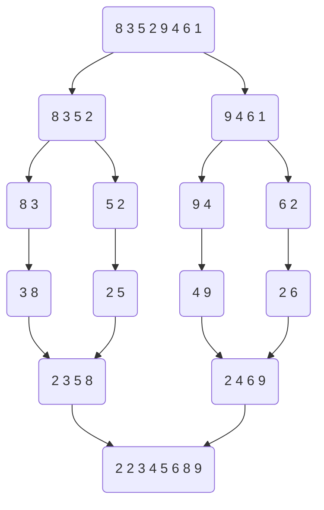
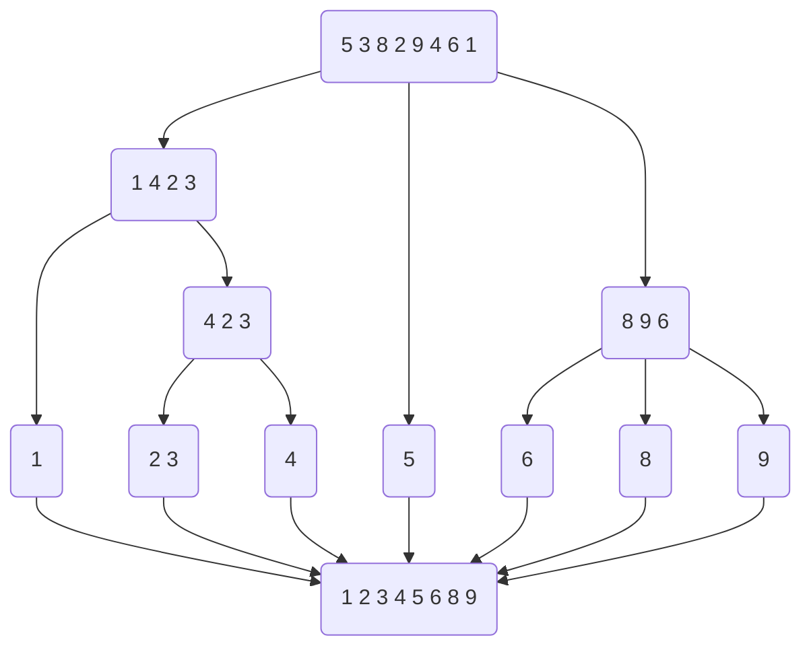

## 分治

> 分而治之，就是将一个大的问题分成多个相似的子问题解决，再把子问题分成更小的子问题，直到最后子问题可以通过简单直接的方法解决，原问题的解即是子问题的解的合并。分而治之方法是一种自顶而下的方法。


## 典型实例：

### 1.二分查找

```java
private boolean find(left,right){
    int mid = (left+right)/2;
    if(left > right){
        return false;
    }
    if(target == nums[mid]){
        return true;
    } else if (target < mid){
        right = mid - 1;
        find(left,right);
    } else {
        left = mid + 1;
        find(left,right);
    }
}
```


### 2.合并排序

```
9 2 3 4 2 5 3 8

```





### 3.快速排序




### 4.斐波拉契

```java

```


### 5.01背包

