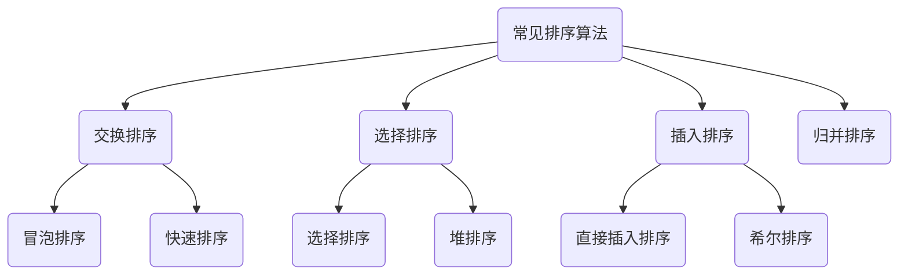

# 排序算法


## 排序算法的稳定性和排序算法分类

> 排序算法的稳定性：能保证两个相等的值，在排序前他们的相对位置不变，即a[0]=3,a[5]=3，如果排序后能保证a[0]的3在a[5]的3的前面就是稳定的算法；

常见排序算法分为以下几类：




## 交换排序

### 冒泡排序算法思想

> 冒泡排序，就像它的名字一样，像气泡慢慢的浮到水面上；冒泡排序中每个数就像是一个气泡，气泡浮到水面上的过程就是冒泡排序的比较，冒泡排序就是通过相邻两个数字进行比较，满足`a>b`或者`b>a`就交换他们的位置，一直到浮出”水面“


### 冒泡排序1

```go
func Sbubble1(ans []int) {
	ansLen := len(ans)
	for i := 0; i < ansLen; i++ {
		for j := 0; j < ansLen-1-i; j++ {
			if ans[j] > ans[j+1] {
				ans[j], ans[j+1] = ans[j+1], ans[j]
			}
		}
	}
	fmt.Printf("冒泡排序：%d个随机数\n", ansLen)
}
```


### 冒泡排序2

> 这种冒泡排序是对冒泡排序进行了优化，添加一个局部变量来记录冒泡排序每一轮有没有交换，如果没有交换，那么所有的数都已经是有序的了，也就没有必要进行比较了，直接终止循环。

```go
func Sbubble2(ans []int) {
	ansLen := len(ans)
	flag := true
	for i := 0; i < ansLen && flag; i++ {
		flag = false
		for j := 0; j < ansLen-1-i; j++ {
			if ans[j] > ans[j+1] {
				ans[j], ans[j+1] = ans[j+1], ans[j]
				flag = true
				//ExportArray(&ans)
			}
		}
	}
	fmt.Printf("冒泡排序：%d个随机数\n", ansLen)
}
```


### 快速排序

> 快速排序的思路很简单，就是取一个枢纽，比它大的数放到右边，比它小的数放到左边，然后利用分治的思想，一直这样分，最终实现排序


```go
func QuickSort(ans []int, low, high int) {
	if low < high {
		pivot := partition(ans, low, high)
		QuickSort(ans, low, pivot-1)
		QuickSort(ans, pivot+1, high)
	}
}

func partition(ans []int, low, high int) int {
	pivot := ans[low]
	for low < high {
		for ; low < high && ans[high] >= pivot; high-- {
		}
		ans[low] = ans[high]
		for ; low < high && ans[low] <= pivot; low++ {
		}
		ans[high] = ans[low]
	}
	ans[low] = pivot
	return low
}
```


## 选择排序

### 算法思想

> 选择排序，其核心就是选择的过程，选择的过程就是选择出最大或者最小的数，如果是n个数的话，就要进行n-1轮比较，最终实现排序的过程；具体的过程就是从第`i`个数开始，跟第`i+1...n-1`个数进行比较，找到最大或者最小的数，那就和第`i`个数交换位置

### 选择排序

```go
func Selection(ans []int) {
	ansLen := len(ans)
	for i := 0; i < ansLen-1; i++ {
		minpos := i
		for j := i + 1; j < ansLen; j++ {
			if ans[j] < ans[minpos] {
				minpos = j
			}
		}
		if minpos != i {
			ans[minpos], ans[i] = ans[i], ans[minpos]
		}
	}
}

```


### 堆排序

> 堆排序，其实就是一个完全二叉树，堆分为大顶堆和小顶堆，大顶堆就是每个节点都大于或者等于其子树的每个节点，小顶堆就是每个子树都小于或者等于其子树的每个节点。堆排序的过程也就是调整的过程，通过一次次的调整，调整出最大或者最小的值，最终通过`n-1`次调整最终调整出有序的序列；首先，调整就是从最后一个非叶子节点开始，比较它的左右子树，如果小于子树，就交换它们，这个时候可能会打乱原来已经调整好的顺序，这个时候就要从被交换的那个子树开始继续调整。


```go
func HeapSort(ans []int) {
	ansLen := len(ans)
	for i := ansLen/2 - 1; i >= 0; i-- {
		adjustHeap(ans, i, ansLen)
	}
	for j := ansLen - 1; j > 0; j-- {
		ans[0], ans[j] = ans[j], ans[0]
		adjustHeap(ans, 0, j)
	}
	fmt.Printf("堆排序：%d个随机数\n", ansLen)
}

func adjustHeap(ans []int, i, length int) {
	pos := i
	for k := 2*i + 1; k < length; k = 2*k + 1 {
		if k+1 < length && ans[k] < ans[k+1] {
			k++
		}
		if ans[k] > ans[pos] {
			ans[k], ans[pos] = ans[pos], ans[k]
			pos = k
		} else {
			break
		}
	}
}
```


## 插入排序

### 直接插入排序

> 就是把序列分为两部分，左边是已经有序的，右边是无序的，每次取出一个无序的数a，如果是从小到大的顺序排列的话，就是从有序序列的最后一个开始比较如果比a大，那么就和a交换，a继续和它的上一个数比较，直到找到比a小的数结束。然后继续从无序序列开始取数，重复操作，直到把无序序列全部取完，这就完成排序了。


```go
func Sinsert(ans []int) {
	ansLen := len(ans)
	for i := 1; i < ansLen; i++ {
		for j := i - 1; j >= 0; j-- {
			if ans[j+1] < ans[j] {
				ans[j+1], ans[j] = ans[j], ans[j+1]
			} else {
				//ExportArray(&ans)
				break
			}
		}
	}
	fmt.Printf("直接插入排序：%d个随机数\n", ansLen)
}
```

### 希尔排序

> 希尔排序的的基本思想是：先将整个待排序的记录序列分割成若干子序列，分别进行直接插入排序，待整个序列中的记录基本有序时，再对全体记录进行一次直接插入排序


```go
func Shellsort(ans []int) {
	ansLen := len(ans)
	for increment := ansLen / 2; increment >= 1; increment = increment / 2 {
		for i := increment; i < ansLen; i++ {
			for j := i - increment; j >= 0 && ans[j] > ans[j+increment]; j -= increment {
				ans[j], ans[j+increment] = ans[j+increment], ans[j]
				//ExportArray(&ans)
			}
		}
	}
	fmt.Printf("希尔排序：%d个随机数\n", ansLen)
}
```


## 归并排序

> 归并排序算就是一个最直接的分治算法，这里就按2路归并讲吧，就是把序列分成2个一组，如果多出一个直接成为一组，每组2个数进行比较排序，每个子序列都有序后，然后两两合并，最后合并成一个有序序列，就完成了排序

```go
func MergeSort(ans []int) []int {
	ansLen := len(ans)
	if ansLen < 2 {
		return ans
	}
	left := ans[0:(ansLen / 2)]
	right := ans[(ansLen/2 + 1):]
	return merge(MergeSort(left), MergeSort(right))
}

func merge(left []int, right []int) []int {
	var res []int
	for len(left) != 0 && len(right) != 0 {
		if left[0] <= right[0] {
			res = append(res, left[0])
			left = left[1:]
		} else {
			res = append(res, right[0])
			right = right[1:]
		}
	}
	for len(left) != 0 {
		res = append(res, left[0])
		left = left[1:]
	}
	for len(right) != 0 {
		res = append(res, right[0])
		right = right[1:]
	}
	return res
}
```

## 基数排序

> 基数排序，就是从个位，十位，百位….一直到最高位，比如个位为1的都放到bucket[1]里面依次类推，当所有的数都放到各自桶里后，然后开始从0号桶中取出所有的数，然后重复操作取十位，百位，等等，直到取到最高位，最后取出来后所有的数都是有序的了


```go
func RadixSort(ans []int) {
	length := getMaxNumLen(ans)
	mod := 10
	for i := 1; i <= length; i++ {
		tmp := setBucket(ans, mod)
		mod *= 10
		getArray(tmp, ans)
	}
}

func getMaxNumLen(ans []int) int {
	maxNum := ans[0]
	for i := 0; i < len(ans); i++ {
		if maxNum < ans[i] {
			maxNum = ans[i]
		}
	}
	maxStr := strconv.Itoa(maxNum)
	return len(maxStr)
}

func setBucket(ans []int, num int) [][]int {
	tmp := make([][]int, 10000000)
	for j := 0; j < len(ans); j++ {
		bucketValue := ans[j] % num / (num / 10)
		tmp[bucketValue] = append(tmp[bucketValue], ans[j])
	}
	return tmp
}

func getArray(tmp [][]int, ans []int) {
	cnt := 0
	for i := 0; i < 10; i++ {
		for j := 0; j < len(tmp[i]); j++ {
			ans[cnt] = tmp[i][j]
			cnt++
		}
	}
	//ExportArray(ans)
}
```

